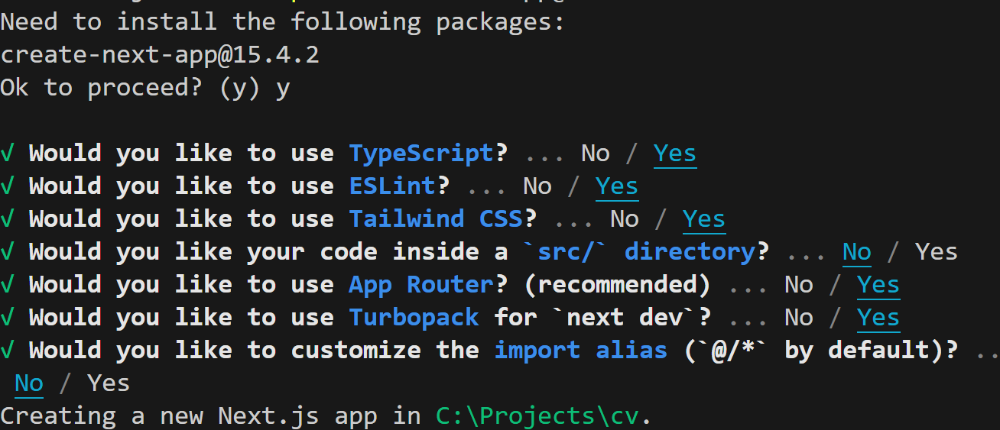

This is a [Next.js](https://nextjs.org) project bootstrapped with [`create-next-app`](https://nextjs.org/docs/app/api-reference/cli/create-next-app).

## Getting Started

In your VS Code terminal type 

```bash
npx create-next-app@latest .
and follow the instructions:
npx create-next-app@latest .

```



Tailsid installation
. Install Tailwind CSS (if not yet installed)
Run this in your project root:

```bash
npm install -D tailwindcss postcss autoprefixer
npx tailwindcss init -p
```
This creates:

tailwind.config.js 

postcss.config.js


 CMS: [Payload](https://payloadcms.com/docs/getting-started/installation)

 ```bash
 
npm i payload @payloadcms/next @payloadcms/richtext-lexical sharp graphql --legacy-peer-deps
npm i @payloadcms/db-postgres --legacy-peer-deps
 ```

 Follow the cos and add the relevant files
 On vercel.com add new, store, create database
 Select Neon,
 create database name
 copy URL via snippet
 create .env file and paste 

 Generate a payload_secret via node -e "console.log(require('crypto').randomBytes(32).toString('base64'))"
then access http://localhost:3001/admin/create-first-user

[Payload Collection Confif](https://payloadcms.com/docs/configuration/collections)

Create a collections folder in app folder

in payloadConfig.ts add in collections array: "POSTS"

[Querying Documents](https://payloadcms.com/docs/queries/overview)

Create a lib folder and initialize [Payload](https://payloadcms.com/docs/local-api/overview) 

For screenshots used https://www.screenshotmachine.com/

add title on hover
form submission
header