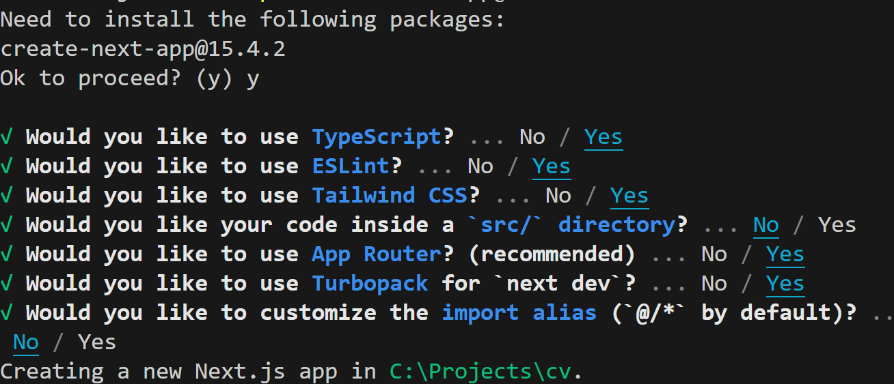

This is a [Next.js](https://nextjs.org) project bootstrapped with [`create-next-app`](https://nextjs.org/docs/app/api-reference/cli/create-next-app).

## Getting Started

In your VS Code terminal type 

```bash
npx create-next-app@latest .
and follow the instructions:
npx create-next-app@latest .

```



Tailsid installation
. Install Tailwind CSS (if not yet installed)
Run this in your project root:

```bash
npm install -D tailwindcss postcss autoprefixer
npx tailwindcss init -p
```
This creates:

tailwind.config.js 

postcss.config.js


 